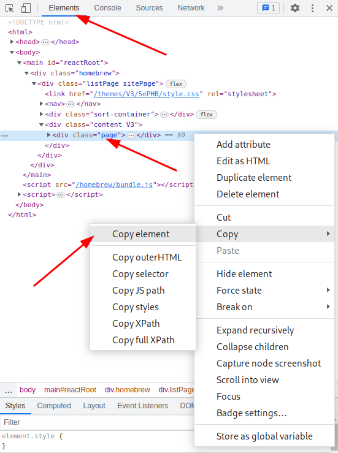

## This is a python script that can be used to backup your MD source files from https://homebrewery.naturalcrit.com

- It parses the CSS from the `
` tag on https://homebrewery.naturalcrit.com/user/${USERNAME} where `$USERNAME` is your username (or any username).  

- The content of this element should be saved to a file called `brews.txt`.  
- If you are logged into your Homebrewery account it will contain all of your brews, both published and unpublished.  
- If you are **NOT** logged into the account, only published brews are visible.

